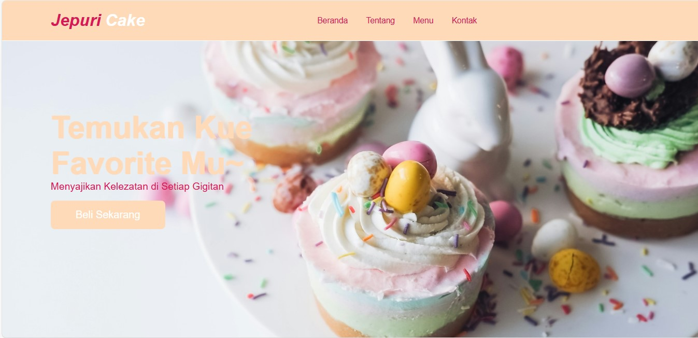
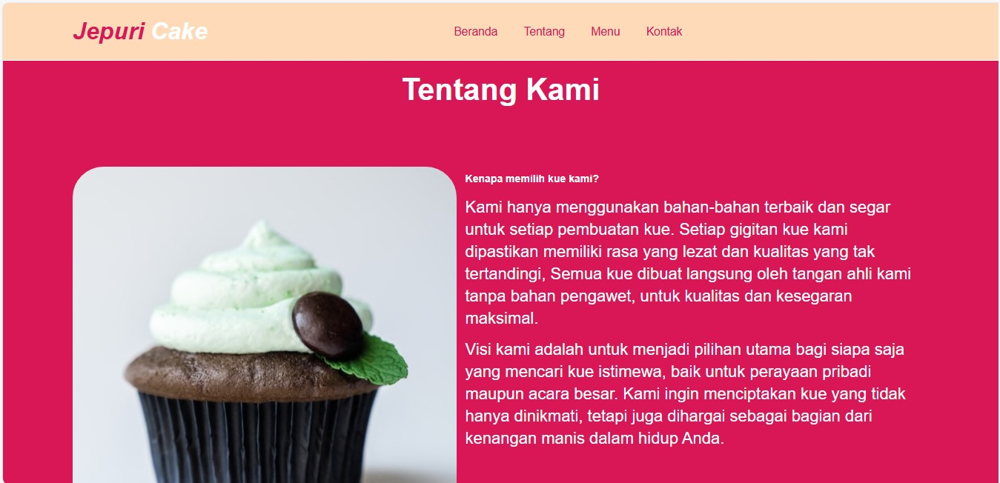
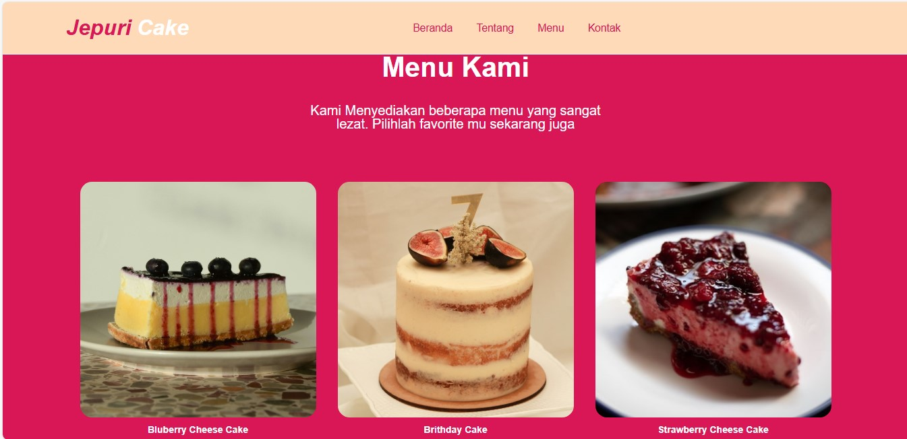
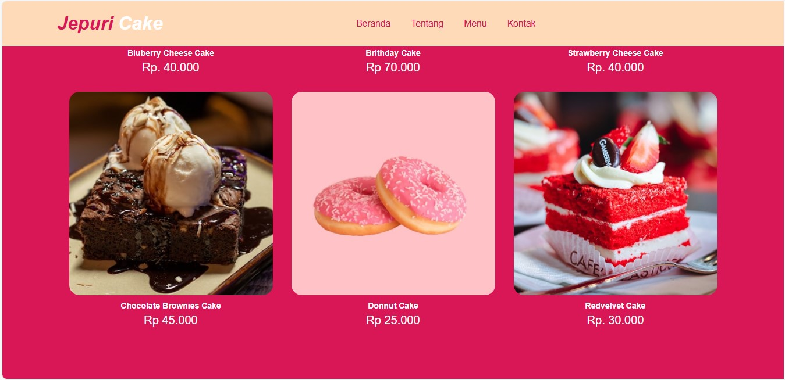

# Tema Kelompok Disini

## Pengenalan Project

Kami adalah mahasiswa dari Universitas Bina Sarana Informatika (UBSI Cut Mutia) yang sedang mengerjakan tugas akhir dengan tema pembuatan website kue. Dalam project ini, kami memilih untuk membuat sebuah website bertema bisnis kue yaitu Jepuri Cake sebagai bentuk penerapan ilmu yang telah kami pelajari. Website ini dirancang untuk memudahkan pelanggan dalam melihat produk, memesan kue, dan mendapatkan informasi terkait usaha kue. Website ini bertujuan untuk mendukung digitalisasi usaha kue dengan menyediakan platform yang memudahkan pelanggan dalam mencari, melihat, dan memesan produk kue. Dengan project ini, kami berharap dapat memberikan kontribusi nyata dalam menghubungkan kebutuhan pelanggan dengan usaha kuliner secara efektif.

## Nama Kelompok
<table border="1">
  <thead>
    <tr>
      <td>No</td>
      <td>NIM</td>
      <td>Nama Anggota</td>
    </tr>
  <thead>
  <tbody>
    <tr>
      <td>1</td>
      <td>19235168</td>
      <td>Putra Sutan Rajab</td>
    </tr>
    <tr>
      <td>2</td>
      <td>19235064</td>
      <td>Jeremia Andreas Tambunan</td>
    </tr>
  </tbody>
</table>

## Skenario Kebutuhan Pengguna
<strong>Pengguna</strong>
<ol>
<li>Pengguna dapat melihat katalog kue dan harga</li>
<li>Pengguna dapat memberikan ulasan mengenai website</li>
</ol>

<!-- Sesuaikan dengan hak akses dari project masing-masing kelompok -->

## Screenshot
<table width="100%">
<tr>
<td><h3 align="center">Menu 1</h3></td>
<td><h3 align="center">Menu 2</h3></td>
</tr>
<tr>
<td><h3 align="center">Menu 3</h3></td>
<td><h3 align="center">Menu 4</h3></td>
</tr>
<tr>
<td><h3 align="center">Menu 5</h3></td>
<td><h3 align="center">Menu 6</h3></td>
</tr>
<tr>
<td><h3 align="center">Menu 7</h3></td>
<td><h3 align="center">Menu 8</h3></td>
</tr>
</table>

## Lisensi

Project ini dibuat untuk menyelesaikan project mata kuliah Web Programming II Universitas Bina Sarana Informatika (UBSI) yang diampu oleh Bpk. <a href="https://github.com/yuris60">Yuris Alkhalifi, M.Kom., CPDSA</a> selaku Dosen. Project ini bersifat open source untuk edukasi.
<!-- Kalian boleh mengubah bentuk lisensi ini sesuai kesepakatan kelompok apakah akan bersifat open source atau tidak -->
<blockquote>Kuliah...? BSI AJA !!</blockquote>

